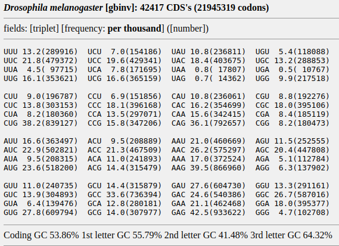

##### Autor: Facundo Martínez

En esta notebook se procederá a realizar el análisis de la información obtenida mediante el algoritmo de Python.

## 1. Tasa de conservación

### 1.1 Carga de los datos

Comienzo por setear el directorio de trabajo e importar los datasets a utilizar:

```{r}
setwd("/home/usuario/Documents/GitHub/Conservacion-de-codones-raros/dataframes")
datos_codones <- read.csv("data3_facundo.csv")
datos_bicodones <- read.csv("data6_facundo.csv")
```

### 1.2 Cálculo de la tasa de conservación para codones

Una vez importados los datasets, procedo a calcular la tasa de conservación de cada codón:

```{r}
datos_codones$tasaConservacion <- datos_codones$conservacion / datos_codones$referencia
```

### 1.3 Establecimiento de codones raros

Deseo establecer cuáles de los codones presentes en la lista son raros. Para ello me he basado en el codon usage de Drosophila melanogaster:

[](https://www.kazusa.or.jp/codon/cgi-bin/showcodon.cgi?species=7227)

Cliqueando la imagen se podrá acceder a la fuente. He clasificado como codones raros a aquellos dentro de cada grupo que poseen el menor uso, además de hacer una distinción entre codones óptimos (los de mayor uso) y subóptimos (los de uso intermedio). Para el siguiente análisis he omitido los codones subóptimos en la lista de codones raros, centrándome así en aquellos que poseen el menor uso dentro de cada grupo de péptidos.

```{r}
codones_raros <- c("TTT", "TTA", "CTT", "CTC", "CTA", "ATT", "ATA", "GTT", "GTC", "GTA", "TCT", 
                   "TCA", "CCT", "ACT", "ACA", "ACG", "GCT", "GCA", "GCG", "TAT", "CAT", "CAA",
                   "AAT", "AAA", "GAA", "TGT", "CGT", "CGA", "CGG", "GCT", "GGG")

# Establecer codones raros
# Raro: TRUE, no raro: FALSE
datos_codones$esRaro <- logical(length = 61)

for(i in codones_raros){
  for(j in datos_codones$codon){
    if(i==j){
      datos_codones[datos_codones$codon==j, 5] <- TRUE
    }
  }
}
```

### 1.4 Gráfico de las tasas de conservación para codones normales y raros

Habiendo establecido en el dataset cuáles codones son raros, procedo a realizar un gráfico para comparar visualmente las tasas de conservación entre codones raros y normales:

```{r}
library(ggplot2)
codones_barplot <- ggplot(datos_codones,
                          aes(   x = codon,
                                 y = tasaConservacion,
                              fill = esRaro)) +
                   geom_bar(stat = "identity") +
                   labs(    x = "Codón", 
                            y = "Tasa de conservación",
                        title = "Conservación de codones individuales") +
                   guides(fill=guide_legend(title="Codón raro:"))

codones_barplot
```

Puede verse que hay dos codones normales que poseen una alta tasa de conservación, estos codones corresponden a los aminoácidos metionina y triptofano. Esto podría deberse a que, por un lado, la metionina es un codón que determina el inicio de la traducción del mRNA y, en el caso del triptofano, a que es el único aminoácido que es especificado por un solo tipo de codón.

### 1.5 Cálculo de la tasa de conservación para pares de codones

Procedo a realizar el mismo análisis, pero para pares de codones. En el siguiente bloque se determinarán las tasas de conservación de cada par codónico, los codones constituyentes del par (en columnas separadas), la tasa de conservación de cada codón constituyente (a partir de `datos_codones`), el producto de las tasas de cada codón constituyente del par (lo cual nos brinda la tasa teórica de conservación del par debida puramente al azar), y cuáles de los pares de codones son pares inhibitorios (es decir, pares de codones raros):

```{r}
datos_bicodones$tasaConservacion <- datos_bicodones$conservacion / datos_bicodones$referencia

datos_bicodones$esRaro <- c(length = 3721) 
datos_bicodones$primerCodon <- character(length = 3721)
datos_bicodones$segundoCodon <- character(length = 3721)

iterador = 1
for(i in datos_bicodones$bicodon){
  vector_codones <- strsplit(i, "(?<=.{3})", perl = TRUE)[[1]]
  datos_bicodones[iterador, 6] <- vector_codones[1]
  datos_bicodones[iterador, 7] <- vector_codones[2]
  iterador = iterador + 1
}

# Tasas individuales de cada codon
datos_bicodones$tasaCodon1 <- numeric(length = 3721)
datos_bicodones$tasaCodon2 <- numeric(length = 3721)

for(i in datos_codones$codon){
  for(j in datos_bicodones$primerCodon){
  if(i == j){
    datos_bicodones[datos_bicodones$primerCodon == i, 8] <- datos_codones[datos_codones$codon == i, 4]
    }
  }
}

for(j in datos_codones$codon){
  for(k in datos_bicodones$segundoCodon){
    if(j == k){
      datos_bicodones[datos_bicodones$segundoCodon == j, 9] <- datos_codones[datos_codones$codon == j, 4]    
    }  
  }
}

# Cálculo del producto de tasas
datos_bicodones$productoDeTasas <- datos_bicodones$tasaCodon1 * datos_bicodones$tasaCodon2

# Determinación de pares de codones inhibitorios
datos_bicodones$cod1Bool <- logical(length = 3721)
datos_bicodones$cod2Bool <- logical(length = 3721)

for(i in codones_raros){
  for(j in datos_bicodones$primerCodon){
    if(i == j){
      datos_bicodones[datos_bicodones$primerCodon == j, 11] <- TRUE
    }
  }
}

for(i in codones_raros){
  for(k in datos_bicodones$segundoCodon){
    if(i == k){
      datos_bicodones[datos_bicodones$segundoCodon == k, 12] <- TRUE
    }
  }
}

datos_bicodones$esRaro <- datos_bicodones$cod1Bool * datos_bicodones$cod2Bool # Raro: 1, no raro: 0
```

### 1.6 Gráfico de la tasa de conservación real vs. teórica

Graficamos la tasa de conservación en función del producto de tasas. Si la tasa de conservación de cada par fuese igual a la predicha por el azar, deberíamos ver muchos puntos distribuidos en una línea recta:

```{r}
modelo <- ggplot(data = datos_bicodones,
                 aes(   x = productoDeTasas,
                        y = tasaConservacion,
                        color = factor(esRaro))) +
          geom_point(stat = "identity",
                     size = 1)

modelo
```

Como se ve en el gráfico anterior, la relación entre la tasa real de conservación y el producto de las tasas de los codones constituyentes sigue una relación lineal. En la esquina inferior derecha puede visualizarse el comportamiento de los pares de codones raros. Para poder visualizar mejor el comportamiento de estos pares, se puede realizar el siguiente gráfico:

```{r}
bicodones_raros <- subset(datos_bicodones, esRaro == 1)

plot_pares_inhibitorios <- ggplot(data = bicodones_raros,
                                  aes(   x = productoDeTasas,
                                         y = tasaConservacion,
                                     label = bicodon)) +
                          geom_rect(aes(xmin = 0, xmax = 0.05, 
                                        ymin = 0, ymax = 0.05),
                                    fill = "#69b3a2",
                                    alpha = 0.2) +
                           geom_point(color = "blueviolet") +
                           xlim(0, 0.05) +
                           ylim(0, 0.2) +
                           geom_hline(yintercept = 0.05, linetype = "dotdash") +
                           geom_vline(xintercept = 0.05, linetype = "dotdash") +
                           geom_abline(aes(intercept = 0,
                                               slope = 1)) +
                           labs(x = "Producto de tasas de conservación de codones constituyentes",
                                y = "Tasa de conservación real del bicodón raro",
                                title = "Tasa real vs. tasa predicha para bicodones raros")
                           
plot_pares_inhibitorios
```

Acá puede verse algo muy interesante. Si la tasa real de conservación fuese igual a la tasa predicha por el azar, todos los bicodones deberían localizarse en la región celeste del gráfico. Pero se observan codones cuya tasa real de conservación es superior a la predicha, de lo cual se desprende que hay algún mecanismo en acción que fuerza la conservación de estos pares inhibitorios.

### 1.7 Normalización de la tasa de conservación

Para visualizar mejor esto, procedo a realizar una normalización de la tasa de conservación, dividiendo la tasa real sobre la predicha. Posteriormente grafico el resultado:

```{r}
datos_bicodones$tasaRealSobrePredicha <- datos_bicodones$tasaConservacion / datos_bicodones$productoDeTasas
bicodones_raros <- subset(datos_bicodones, esRaro == 1)
bicodones_raros_conservados <- subset(bicodones_raros, tasaRealSobrePredicha > 50)

plot_pares_inhibitorios_conservados <- ggplot(data = bicodones_raros_conservados,
                                              aes(   x = productoDeTasas,
                                                     y = tasaConservacion,
                                                     label = bicodon)) +
                                       geom_point(color = "blueviolet") +
                                       xlim(0, 0.0015) +
                                       ylim(0, 0.2) +
                                       labs(x = "Producto de tasas de conservación de codones constituyentes",
                                            y = "Tasa de conservación real del bicodón raro",
                                            title = "Pares de codones raros conservados")  +
                                       geom_text(aes(label = bicodon, 
                                                     hjust = 0, 
                                                     vjust = 0),
                                                 size = 3,
                                                 check_overlap = TRUE)
                                       
plot_pares_inhibitorios_conservados
bicodones_raros_conservados$bicodon
```

¿Qué sucede con los bicodones normales?

```{r}
bicodones_normales <- subset(datos_bicodones, esRaro == 0)
bicodones_normales_conservados <- subset(bicodones_normales, tasaRealSobrePredicha > 50)
bicodones_normales_conservados$bicodon
```

A pesar de que el número de pares de codones normales es superior al de pares de codones raros, el número de pares inhibitorios conservados es 4.5 veces mayor que el de pares normales conservados.

## 2. Modelo de ajuste lineal

Para ver el grado de ajuste lineal, se realizó el siguiente modelo graficando la tasa real de conservación de pares de codones en función de la tasa teórica de conservación, tomando como ordenada al origen `y(0) = 0`:

```{r}
modelo_lineal <- lm(tasaConservacion ~ 0 + productoDeTasas, data = datos_bicodones)

summary(modelo_lineal)
plot(modelo_lineal)
```

Puede verse que el modelo tiene un muy buen ajuste lineal, ya que el valor de R cuadrado es 0.81, pero los datos no son normales.

## 3. Z-score Distribution Plot

```{r}
codon   <- c("TTT", "TTC", "TTA", "TTG", "CTT", "CTC", "CTA", "CTG", "ATT", "ATC", "ATA", "ATG", "GTT", "GTC", "GTA", "GTG",
             "TCT", "TCC", "TCA", "TCG", "CCT", "CCC", "CCA", "CCG", "ACT", "ACC", "ACA", "ACG", "GCT", "GCC", "GCA", "GCG",
             "TAT", "TAC", "CAT", "CAC", "CAA", "CAG", "AAT", "AAC", "AAA", "AAG", "GAT", "GAC", "GAA", "GAG",
             "TGT", "TGC", "TGG", "CGT", "CGC", "CGA", "CGG", "AGT", "AGC", "AGA", "AGG", "GGT", "GGC", "GGA", "GGG")

peptido <- c("Phe", "Phe", "Leu", "Leu", "Leu", "Leu", "Leu", "Leu", "Ile", "Ile", "Ile", "Met", "Val", "Val", "Val", "Val",
             "Ser", "Ser", "Ser", "Ser", "Pro", "Pro", "Pro", "Pro", "Thr", "Thr", "Thr", "Thr", "Ala", "Ala", "Ala", "Ala",
             "Tyr", "Tyr", "His", "His", "Gln", "Gln", "Asn", "Asn", "Lys", "Lys", "Asp", "Asp", "Glu", "Glu",
             "Cys", "Cys", "Trp", "Arg", "Arg", "Arg", "Arg", "Ser", "Ser", "Arg", "Arg", "Gly", "Gly", "Gly", "Gly")

peptido_segun_codon <- data.frame(codon, peptido, row.names = NULL)
datos_bicodones$primerPeptido <- character(length = 3721)
datos_bicodones$segundoPeptido <- character(length = 3721)

for(i in peptido_segun_codon$codon){
  for(j in datos_bicodones$primerCodon){
    if(i == j){
      datos_bicodones[datos_bicodones$primerCodon == j, 14] <- peptido_segun_codon[peptido_segun_codon$codon == j, 2]
    }
  }
}

for(i in peptido_segun_codon$codon){
  for(k in datos_bicodones$segundoCodon){
    if(i == k){
      datos_bicodones[datos_bicodones$segundoCodon == k, 15] <- peptido_segun_codon[peptido_segun_codon$codon == k, 2]
    }
  }
}

datos_bicodones$dipeptido <- paste(datos_bicodones$primerPeptido, datos_bicodones$segundoPeptido, sep = "-")
datos_bicodones$factorDipeptido <- factor(datos_bicodones$dipeptido)

# Para el Z-score necesito calcular la media de la tasa real sobre predicha
# en cada familia de dipeptidos, ademas del desvio estandar de la familia

vector_auxiliar <- c() #  Almacena las tasas
for(i in levels(datos_bicodones$factorDipeptido)){
  for(j in datos_bicodones$dipeptido){
    if(i == j){
      vector_auxiliar <- c(vector_auxiliar, datos_bicodones[datos_bicodones$dipeptido == j, 13])
    }
  }
}
```
