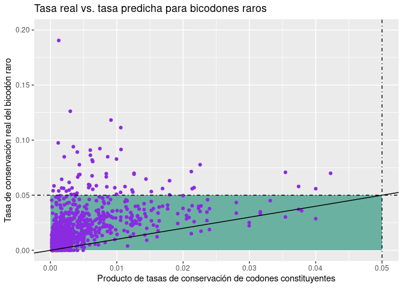
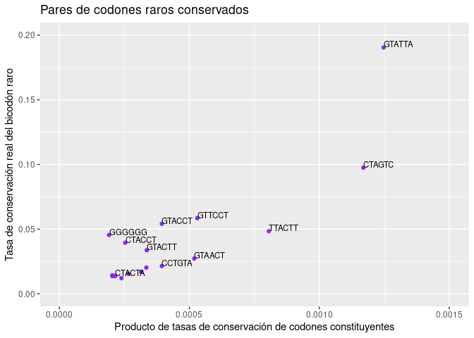
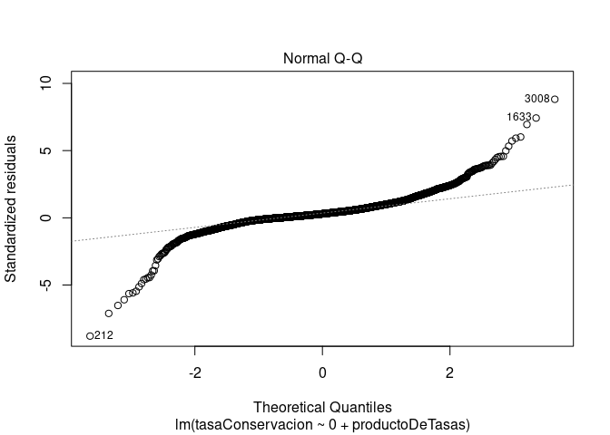
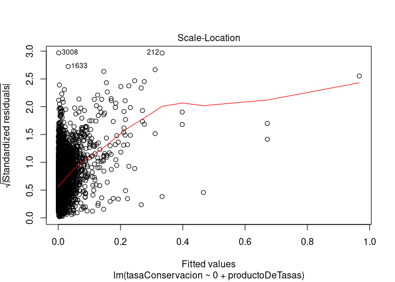
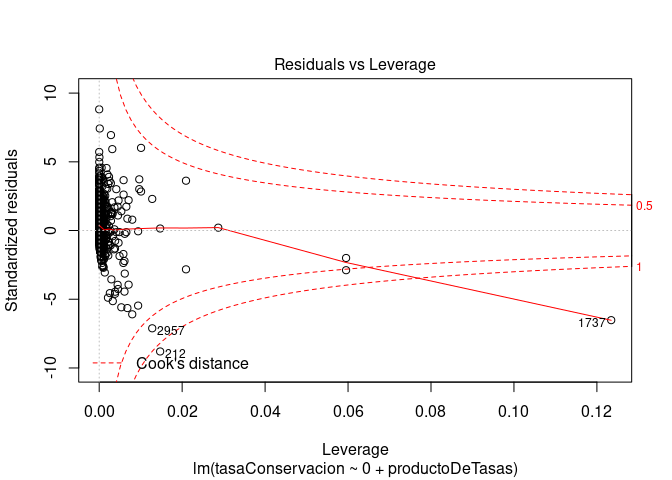
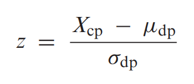
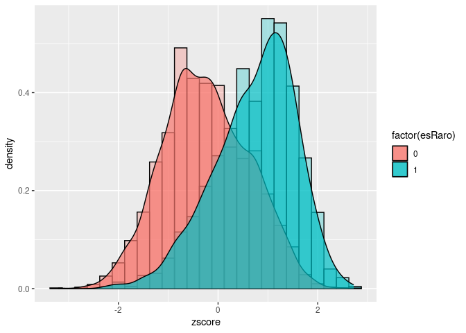

Análisis de la tasa de conservación de codones y pares de codones
================

##### Autor: Facundo Martínez

En esta notebook se procederá a realizar el análisis de la información
obtenida mediante el algoritmo de Python.

## 1. Tasa de conservación

### 1.1 Carga de los datos

Comienzo por setear el directorio de trabajo e importar los datasets a
utilizar:

``` r
setwd("/home/usuario/Documents/GitHub/Conservacion-de-codones-raros/dataframes")
datos_codones <- read.csv("data3_facundo.csv")
datos_bicodones <- read.csv("data6_facundo.csv")
```

### 1.2 Cálculo de la tasa de conservación para codones

Una vez importados los datasets, procedo a calcular la tasa de
conservación de cada codón:

``` r
datos_codones$tasaConservacion <- datos_codones$conservacion / datos_codones$referencia
```

### 1.3 Establecimiento de codones raros

Deseo establecer cuáles de los codones presentes en la lista son raros.
Para ello me he basado en el codon usage de Drosophila melanogaster:

[](https://www.kazusa.or.jp/codon/cgi-bin/showcodon.cgi?species=7227)

Cliqueando la imagen se podrá acceder a la fuente. He clasificado como
codones raros a aquellos dentro de cada grupo que poseen el menor uso,
además de hacer una distinción entre codones óptimos (los de mayor uso)
y subóptimos (los de uso intermedio). Para el siguiente análisis he
omitido los codones subóptimos en la lista de codones raros, centrándome
así en aquellos que poseen el menor uso dentro de cada grupo de
péptidos.

``` r
codones_raros <- c("TTT", "TTA", "CTT", "CTC", "CTA", "ATT", "ATA", "GTT", "GTC", "GTA", "TCT", 
                   "TCA", "CCT", "ACT", "ACA", "ACG", "GCT", "GCA", "GCG", "TAT", "CAT", "CAA",
                   "AAT", "AAA", "GAA", "TGT", "CGT", "CGA", "CGG", "GCT", "GGG")

# Establecer codones raros
# Raro: TRUE, no raro: FALSE
datos_codones$esRaro <- logical(length = 61)

for(i in codones_raros){
  for(j in datos_codones$codon){
    if(i==j){
      datos_codones[datos_codones$codon==j, 5] <- TRUE
    }
  }
}
```

### 1.4 Gráfico de las tasas de conservación para codones normales y raros

Habiendo establecido en el dataset cuáles codones son raros, procedo a
realizar un gráfico para comparar visualmente las tasas de conservación
entre codones raros y normales:

``` r
library(ggplot2)
codones_barplot <- ggplot(datos_codones,
                          aes(   x = codon,
                                 y = tasaConservacion,
                              fill = esRaro)) +
                   geom_bar(stat = "identity") +
                   labs(    x = "Codón", 
                            y = "Tasa de conservación",
                        title = "Conservación de codones individuales") +
                   guides(fill = guide_legend(title = "¿Es un codón raro?")) +
                   theme(axis.text.x = element_text(angle = 90, 
                                                    hjust = 1, 
                                                    vjust = 0.5,
                                                    size = 6,
                                                    face = "bold"))

codones_barplot
```

<!-- -->

Puede verse que hay dos codones normales que poseen una alta tasa de
conservación, estos codones corresponden a los aminoácidos metionina y
triptofano. Esto podría deberse a que, por un lado, la metionina es un
codón que determina el inicio de la traducción del mRNA y, en el caso
del triptofano, a que es el único aminoácido que es especificado por un
solo tipo de codón.

### 1.5 Cálculo de la tasa de conservación para pares de codones

Procedo a realizar el mismo análisis, pero para pares de codones. En el
siguiente bloque se determinarán las tasas de conservación de cada par
codónico, los codones constituyentes del par (en columnas separadas), la
tasa de conservación de cada codón constituyente (a partir de
`datos_codones`), el producto de las tasas de cada codón constituyente
del par (lo cual nos brinda la tasa teórica de conservación del par
debida puramente al azar), y cuáles de los pares de codones son pares
inhibitorios (es decir, pares de codones raros):

``` r
datos_bicodones$tasaConservacion <- datos_bicodones$conservacion / datos_bicodones$referencia

datos_bicodones$esRaro <- c(length = 3721) 
datos_bicodones$primerCodon <- character(length = 3721)
datos_bicodones$segundoCodon <- character(length = 3721)

iterador = 1
for(i in datos_bicodones$bicodon){
  vector_codones <- strsplit(i, "(?<=.{3})", perl = TRUE)[[1]]
  datos_bicodones[iterador, 6] <- vector_codones[1]
  datos_bicodones[iterador, 7] <- vector_codones[2]
  iterador = iterador + 1
}

# Tasas individuales de cada codon
datos_bicodones$tasaCodon1 <- numeric(length = 3721)
datos_bicodones$tasaCodon2 <- numeric(length = 3721)

for(i in datos_codones$codon){
  for(j in datos_bicodones$primerCodon){
  if(i == j){
    datos_bicodones[datos_bicodones$primerCodon == i, 8] <- datos_codones[datos_codones$codon == i, 4]
    }
  }
}

for(j in datos_codones$codon){
  for(k in datos_bicodones$segundoCodon){
    if(j == k){
      datos_bicodones[datos_bicodones$segundoCodon == j, 9] <- datos_codones[datos_codones$codon == j, 4]    
    }  
  }
}

# Cálculo del producto de tasas
datos_bicodones$productoDeTasas <- datos_bicodones$tasaCodon1 * datos_bicodones$tasaCodon2

# Determinación de pares de codones inhibitorios
datos_bicodones$cod1Bool <- logical(length = 3721)
datos_bicodones$cod2Bool <- logical(length = 3721)

for(i in codones_raros){
  for(j in datos_bicodones$primerCodon){
    if(i == j){
      datos_bicodones[datos_bicodones$primerCodon == j, 11] <- TRUE
    }
  }
}

for(i in codones_raros){
  for(k in datos_bicodones$segundoCodon){
    if(i == k){
      datos_bicodones[datos_bicodones$segundoCodon == k, 12] <- TRUE
    }
  }
}

datos_bicodones$esRaro <- datos_bicodones$cod1Bool * datos_bicodones$cod2Bool # Raro: 1, no raro: 0
```

### 1.6 Gráfico de la tasa de conservación real vs. teórica

Graficamos la tasa de conservación en función del producto de tasas. Si
la tasa de conservación de cada par fuese igual a la predicha por el
azar, deberíamos ver muchos puntos distribuidos en una línea recta:

``` r
modelo <- ggplot(data = datos_bicodones,
                 aes(   x = productoDeTasas,
                        y = tasaConservacion,
                        color = factor(esRaro))) +
          geom_point(stat = "identity",
                     size = 1)

modelo
```

<!-- -->

Como se ve en el gráfico anterior, la relación entre la tasa real de
conservación y el producto de las tasas de los codones constituyentes
sigue una relación lineal. En la esquina inferior derecha puede
visualizarse el comportamiento de los pares de codones raros. Para poder
visualizar mejor el comportamiento de estos pares, se puede realizar el
siguiente gráfico:

``` r
bicodones_raros <- subset(datos_bicodones, esRaro == 1)

plot_pares_inhibitorios <- ggplot(data = bicodones_raros,
                                  aes(   x = productoDeTasas,
                                         y = tasaConservacion,
                                     label = bicodon)) +
                          geom_rect(aes(xmin = 0, xmax = 0.05, 
                                        ymin = 0, ymax = 0.05),
                                    fill = "#69b3a2",
                                    alpha = 0.2) +
                           geom_point(color = "blueviolet") +
                           xlim(0, 0.05) +
                           ylim(0, 0.2) +
                           geom_hline(yintercept = 0.05, linetype = "dotdash") +
                           geom_vline(xintercept = 0.05, linetype = "dotdash") +
                           geom_abline(aes(intercept = 0,
                                               slope = 1)) +
                           labs(x = "Producto de tasas de conservación de codones constituyentes",
                                y = "Tasa de conservación real del bicodón raro",
                                title = "Tasa real vs. tasa predicha para bicodones raros")
                           
plot_pares_inhibitorios
```

<!-- -->

Acá puede verse algo muy interesante. Si la tasa real de conservación
fuese igual a la tasa predicha por el azar, todos los bicodones deberían
localizarse en la región celeste del gráfico. Pero se observan codones
cuya tasa real de conservación es superior a la predicha, de lo cual se
desprende que hay algún mecanismo en acción que fuerza la conservación
de estos pares inhibitorios.

### 1.7 Normalización de la tasa de conservación

Para visualizar mejor esto, procedo a realizar una normalización de la
tasa de conservación, dividiendo la tasa real sobre la predicha.
Posteriormente grafico el resultado:

``` r
datos_bicodones$tasaRealSobrePredicha <- datos_bicodones$tasaConservacion / datos_bicodones$productoDeTasas
bicodones_raros <- subset(datos_bicodones, esRaro == 1)
bicodones_raros_conservados <- subset(bicodones_raros, tasaRealSobrePredicha > 50)

plot_pares_inhibitorios_conservados <- ggplot(data = bicodones_raros_conservados,
                                              aes(   x = productoDeTasas,
                                                     y = tasaConservacion,
                                                     label = bicodon)) +
                                       geom_point(color = "blueviolet") +
                                       xlim(0, 0.0015) +
                                       ylim(0, 0.2) +
                                       labs(x = "Producto de tasas de conservación de codones constituyentes",
                                            y = "Tasa de conservación real del bicodón raro",
                                            title = "Pares de codones raros conservados")  +
                                       geom_text(aes(label = bicodon, 
                                                     hjust = 0, 
                                                     vjust = 0),
                                                 size = 3,
                                                 check_overlap = TRUE)
                                       
plot_pares_inhibitorios_conservados
```

<!-- -->

``` r
bicodones_raros_conservados$bicodon
```

    ##  [1] TTACTT CTACTA CTACCT CTAGTC CTTGGG CCTGTA CCTGGG CGGCCT CGGGGG GTAACT
    ## [11] GTATTA GTACTA GTACTT GTACCT GTTCCT GGGACT GGGCTT GGGGGG
    ## 3721 Levels: AAAAAA AAAAAC AAAAAG AAAAAT AAAACA AAAACC AAAACG AAAACT ... TTTTTT

¿Qué sucede con los bicodones normales?

``` r
bicodones_normales <- subset(datos_bicodones, esRaro == 0)
bicodones_normales_conservados <- subset(bicodones_normales, tasaRealSobrePredicha > 50)
bicodones_normales_conservados$bicodon
```

    ## [1] AGGCTT CTTCCA GGGAGA GGGAGG
    ## 3721 Levels: AAAAAA AAAAAC AAAAAG AAAAAT AAAACA AAAACC AAAACG AAAACT ... TTTTTT

A pesar de que el número de pares de codones normales es superior al de
pares de codones raros, el número de pares inhibitorios conservados es
4.5 veces mayor que el de pares normales conservados.

## 2. Modelo de ajuste lineal

Para ver el grado de ajuste lineal, se realizó el siguiente modelo
graficando la tasa real de conservación de pares de codones en función
de la tasa teórica de conservación, tomando como ordenada al origen
`y(0) = 0`:

``` r
modelo_lineal <- lm(tasaConservacion ~ 0 + productoDeTasas, data = datos_bicodones)

summary(modelo_lineal)
```

    ## 
    ## Call:
    ## lm(formula = tasaConservacion ~ 0 + productoDeTasas, data = datos_bicodones)
    ## 
    ## Residuals:
    ##       Min        1Q    Median        3Q       Max 
    ## -0.187103 -0.000145  0.006327  0.015259  0.188905 
    ## 
    ## Coefficients:
    ##                 Estimate Std. Error t value Pr(>|t|)    
    ## productoDeTasas  1.25980    0.00981   128.4   <2e-16 ***
    ## ---
    ## Signif. codes:  0 '***' 0.001 '**' 0.01 '*' 0.05 '.' 0.1 ' ' 1
    ## 
    ## Residual standard error: 0.02142 on 3720 degrees of freedom
    ## Multiple R-squared:  0.8159, Adjusted R-squared:  0.8159 
    ## F-statistic: 1.649e+04 on 1 and 3720 DF,  p-value: < 2.2e-16

``` r
plot(modelo_lineal)
```

<!-- --><!-- --><!-- --><!-- -->

Puede verse que el modelo tiene un muy buen ajuste lineal, ya que el
valor de R cuadrado es 0.81, pero los datos no son normales.

## 3. Z-score Distribution Plot

### 3.1 Ecuación del z-score

Para calcular el z-score se utiliza la siguiente ecuación:



Donde Xcp representa la tasa normalizada de conservación del par de
codones, udp depresenta la media normalizada de la tasa de conservación
de la familia de pares de codones que codifican un mismo dipéptido, y
sigmadp es el desvío estándar para la familia de dipéptidos. Esta
ecuación asume que la distribución de los datos es normal. El z-score
nos da una idea de cuán alejados están ciertos pares de codones de
otros.

### 3.2 Cálculo de las medias y desvíos para dipéptidos

Para medir la distancia de una muestra con respecto a su media en
unidades de desvío estándar, es necesario hacer un cálculo del z-score a
partir del logaritmo decimal de las tasas normalizadas de conservación
para cada grupo de dipéptidos.

``` r
codon   <- c("TTT", "TTC", "TTA", "TTG", "CTT", "CTC", "CTA", "CTG", "ATT", "ATC", "ATA", "ATG", "GTT", "GTC", "GTA", "GTG",
             "TCT", "TCC", "TCA", "TCG", "CCT", "CCC", "CCA", "CCG", "ACT", "ACC", "ACA", "ACG", "GCT", "GCC", "GCA", "GCG",
             "TAT", "TAC", "CAT", "CAC", "CAA", "CAG", "AAT", "AAC", "AAA", "AAG", "GAT", "GAC", "GAA", "GAG",
             "TGT", "TGC", "TGG", "CGT", "CGC", "CGA", "CGG", "AGT", "AGC", "AGA", "AGG", "GGT", "GGC", "GGA", "GGG")

peptido <- c("Phe", "Phe", "Leu", "Leu", "Leu", "Leu", "Leu", "Leu", "Ile", "Ile", "Ile", "Met", "Val", "Val", "Val", "Val",
             "Ser", "Ser", "Ser", "Ser", "Pro", "Pro", "Pro", "Pro", "Thr", "Thr", "Thr", "Thr", "Ala", "Ala", "Ala", "Ala",
             "Tyr", "Tyr", "His", "His", "Gln", "Gln", "Asn", "Asn", "Lys", "Lys", "Asp", "Asp", "Glu", "Glu",
             "Cys", "Cys", "Trp", "Arg", "Arg", "Arg", "Arg", "Ser", "Ser", "Arg", "Arg", "Gly", "Gly", "Gly", "Gly")

peptido_segun_codon <- data.frame(codon, peptido, row.names = NULL)
datos_bicodones$primerPeptido <- character(length = 3721)
datos_bicodones$segundoPeptido <- character(length = 3721)

for(i in peptido_segun_codon$codon){
  for(j in datos_bicodones$primerCodon){
    if(i == j){
      datos_bicodones[datos_bicodones$primerCodon == j, 14] <- peptido_segun_codon[peptido_segun_codon$codon == j, 2]
    }
  }
}

for(i in peptido_segun_codon$codon){
  for(k in datos_bicodones$segundoCodon){
    if(i == k){
      datos_bicodones[datos_bicodones$segundoCodon == k, 15] <- peptido_segun_codon[peptido_segun_codon$codon == k, 2]
    }
  }
}

datos_bicodones$dipeptido <- paste(datos_bicodones$primerPeptido, datos_bicodones$segundoPeptido, sep = "-")

# Para el Z-score necesito calcular la media de la tasa real sobre predicha
# en cada familia de dipeptidos, ademas del desvio estandar de la familia

datos_bicodones$logTasaNormalizada <- log(datos_bicodones$tasaRealSobrePredicha)

# datos <- data.frame(
#   dipeptido = levels(factor(analisis_bicodones$dipeptido)),
#   media = tapply(analisis_bicodones$logTasaNormalizada, analisis_bicodones$dipeptido, mean),
#   desvio = tapply(analisis_bicodones$logTasaNormalizada, analisis_bicodones$dipeptido, sd)
# )

datos <- read.csv("datos_zscore.csv")
head(datos)
```

    ##   dipeptido     media    desvio
    ## 1   Ala-Ala 1.2754385 0.9233920
    ## 2   Ala-Arg 1.4814825 1.0465992
    ## 3   Ala-Asn 0.7317988 1.0342292
    ## 4   Ala-Asp 0.7142307 0.4120768
    ## 5   Ala-Cys 0.5410612 0.4105244
    ## 6   Ala-Gln 1.1132784 1.3674121

Por un problema de R, el anterior bloque de códigos no retorna un
dataframe con una lista de dipéptidos, sino una lista con las posiciones
de cada péptido correspondiente en el vector `peptido`. Por eso he
importado un nuevo dataframe hecho a partir de una versión anterior de
mis datos, que sí contiene los grupos de dipéptidos.

### 3.3 Z-score para cada par de codones

Usando las medias y desvíos calculados anteriormente, procedo a calcular
el z-score:

``` r
datos_zscore <- read.csv("/home/usuario/Documents/GitHub/Conservacion-de-codones-raros/dataframes/datos_zscore.csv")
analisis_bicodones_V2 <- read.csv("analisis_bicodones_V2.csv")
analisis_bicodones_V2$zscore <- numeric(length = 3721)

for (i in datos_zscore$dipeptido){
  u = datos_zscore[datos_zscore$dipeptido == i, 2]
  sdev = datos_zscore[datos_zscore$dipeptido == i, 3]
  for (j in analisis_bicodones_V2$dipeptido){
    if (i == j){
      x <- analisis_bicodones_V2[analisis_bicodones_V2$dipeptido == j, 18]
      z = (x - u)/sdev
      analisis_bicodones_V2[analisis_bicodones_V2$dipeptido == j, 19] <- z
    }
  }
}
```

### 3.4 Z-scores visualizados en histograma

Ya calculados los z-scores en el paso anterior, procedo a graficarlos:

``` r
histograma <- ggplot(analisis_bicodones_V2,
                     aes(x = zscore, fill = factor(esRaro))) +
              geom_histogram(binwidth = 0.25,
                             colour = 'black',
                             position = "identity",
                             alpha = 0.3, aes(y = ..density..)) +
              geom_density(alpha = 0.7)
histograma
```

    ## Warning: Removed 4 rows containing non-finite values (stat_bin).

    ## Warning: Removed 4 rows containing non-finite values (stat_density).

<!-- -->

## 4. Contenido de GC

A fines investigativos se desea conocer si existe una preferencia por GC
en los pares de codones. Para eso se ejecutan las siguientes líneas de
código en consola:

``` r
bicodones_normales_conservados$bicodon
```

    ## [1] AGGCTT CTTCCA GGGAGA GGGAGG
    ## 3721 Levels: AAAAAA AAAAAC AAAAAG AAAAAT AAAACA AAAACC AAAACG AAAACT ... TTTTTT

``` r
bicodones_raros_conservados$bicodon
```

    ##  [1] TTACTT CTACTA CTACCT CTAGTC CTTGGG CCTGTA CCTGGG CGGCCT CGGGGG GTAACT
    ## [11] GTATTA GTACTA GTACTT GTACCT GTTCCT GGGACT GGGCTT GGGGGG
    ## 3721 Levels: AAAAAA AAAAAC AAAAAG AAAAAT AAAACA AAAACC AAAACG AAAACT ... TTTTTT

En el caso de los pares de codones normales, se observa que 3 de los 4
pares presentan un motivo -GG en el primer codón del par. Mientras que
en los pares de codones raros se observa que hay una clara preferencia
por GC en la primera letra del primer codón.
